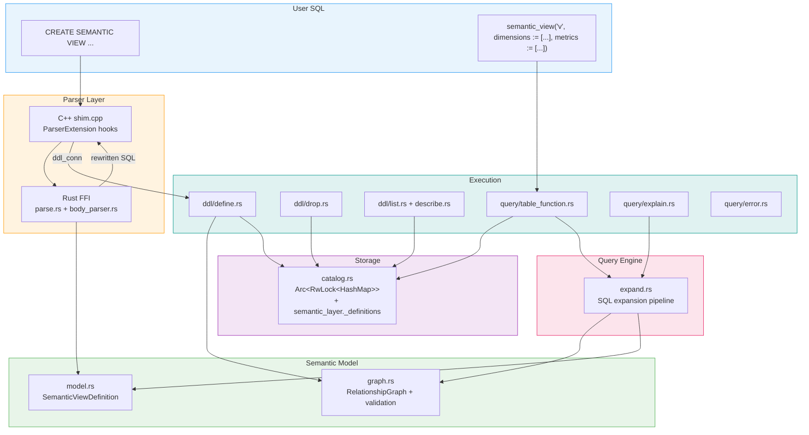
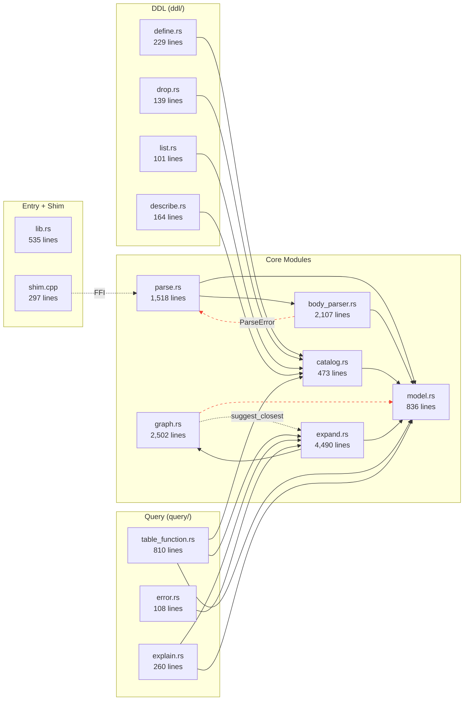
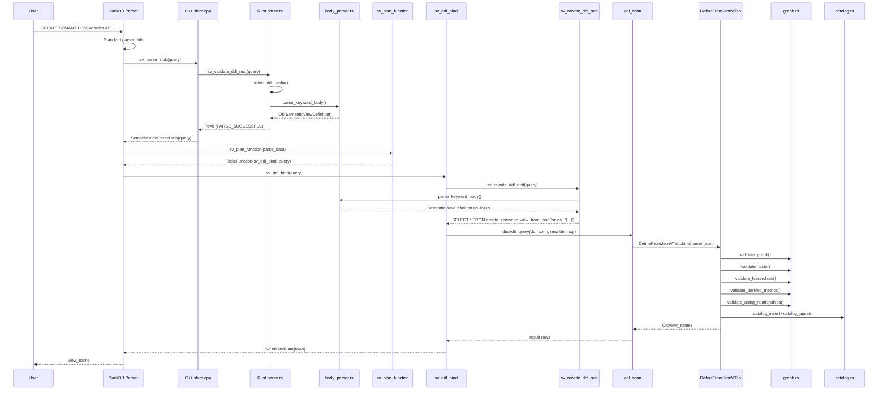
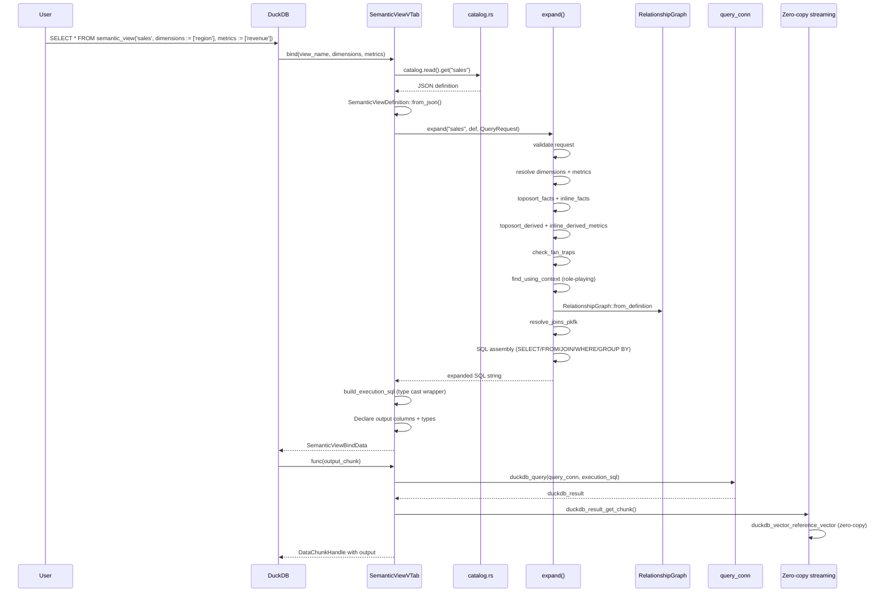
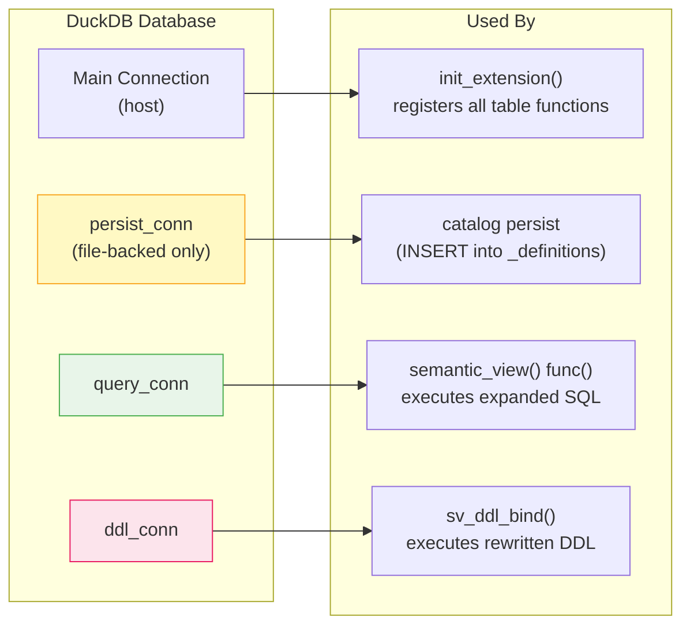
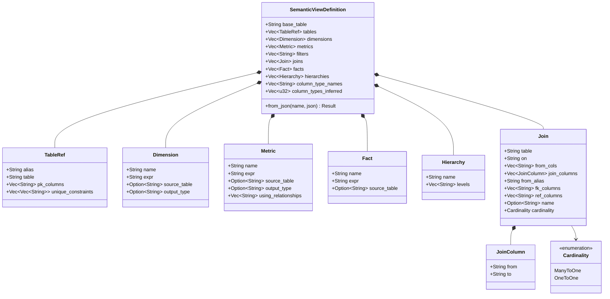
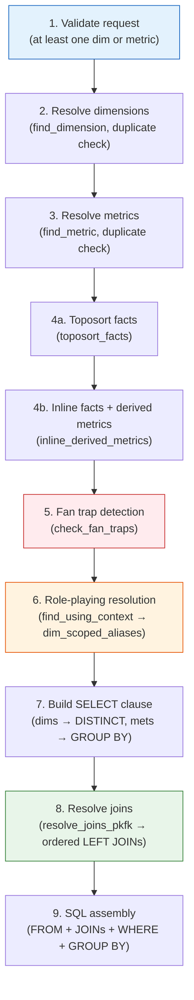

# Architecture: DuckDB Semantic Views Extension

This document describes the internal architecture of the `duckdb-semantic-views` extension as of v0.5.4. The codebase spans 14,578 lines across 16 Rust source files and 1 C++ shim (297 lines), with 468 tests (376 unit + 36 integration + 44 property + 6 proptests + 5 output + 1 doc). The extension implements a declarative semantic layer for DuckDB: users define dimensions, metrics, relationships, facts, and hierarchies via `CREATE SEMANTIC VIEW` DDL, then query them via a `semantic_view()` table function that expands to SQL at runtime.

## 1. High-Level Component Overview



**Cross-cutting: Three DuckDB connections** (`persist_conn`, `query_conn`, `ddl_conn`) work around the non-reentrant `ClientContext` lock. See [Section 6](#6-connection-management).

## 2. Module Map with Line Counts



**Circular dependency:** `graph.rs` imports `expand::suggest_closest` and `expand.rs` imports `graph::RelationshipGraph`. The `suggest_closest` function is a generic Levenshtein utility that has no semantic dependency on the expansion engine.

## 3. DDL Flow -- CREATE SEMANTIC VIEW

The DDL path spans two languages and three phases: parse, plan, and bind/execute.



Key observations:
- **Double parse**: Both `sv_validate_ddl_rust` (parse phase) and `sv_rewrite_ddl_rust` (plan/bind phase) call `body_parser::parse_keyword_body`. This is intentional -- no state carries between the C++ parse and plan callbacks, and DDL is infrequent enough that the cost is negligible.
- **Error positioning**: The validate path tracks byte offsets through parsing so the C++ shim can set `error_location` on `ParserExtensionParseResult`, giving users caret-positioned error messages.

## 4. Query Flow -- semantic_view()



The `build_execution_sql` step wraps the expanded SQL in a subquery with explicit `CAST` expressions when bind-time types differ from the inferred types (e.g., DuckDB's optimizer may promote `BIGINT` to `HUGEINT`).

## 5. Connection Management



| Connection | Created | Purpose | Why separate? |
|---|---|---|---|
| **main** (host) | By DuckDB | Registers table functions, reads catalog at init | -- |
| **persist_conn** | At init (file-backed only) | Writes to `semantic_layer._definitions` | ClientContext lock is non-reentrant; `bind()` already holds it |
| **query_conn** | At init (always) | Executes expanded SQL in `semantic_view()` `func()` | Same lock reason; query runs inside `func()` callback |
| **ddl_conn** | At init (always) | Executes rewritten DDL SQL in `sv_ddl_bind()` | Plan/bind holds ClientContext; DDL rewrite needs a second execution context |

## 6. Data Model



All types derive `Serialize`/`Deserialize` (serde) and `Arbitrary` (proptest). The `Join` struct carries legacy fields (`on`, `from_cols`, `join_columns`) alongside the current PK/FK model (`from_alias`, `fk_columns`, `ref_columns`, `name`, `cardinality`) for backward-compatible deserialization of stored JSON.

## 7. Expansion Pipeline Internals

The `expand()` function (line 1240 of `expand.rs`) implements a 9-step pipeline:



Supporting functions called by the pipeline:

| Step | Function | Lines | Purpose |
|---|---|---|---|
| 4a | `toposort_facts()` | 673-750 | Topological sort of fact dependency DAG |
| 4b | `inline_facts()` | 752-802 | Word-boundary-safe substitution of fact refs in expressions |
| 4b | `toposort_derived()` | 804-883 | Topological sort of derived metric DAG |
| 4b | `inline_derived_metrics()` | 885-1008 | Resolves all metric expressions (base facts + derived refs) |
| 5 | `check_fan_traps()` | 1010-1237 | Detects one-to-many aggregation across relationship boundaries |
| 6 | `find_using_context()` | (inline) | Resolves role-playing table aliases via USING RELATIONSHIPS |
| 8 | `resolve_joins_pkfk()` | 487-671 | BFS from base table to collect required join aliases |
| 8 | `synthesize_on_clause()` | 278-290 | Generates ON clause from FK/PK column pairs |

## 8. Architectural Critique

### C1: expand.rs is a monolith (4,490 lines)

**Severity: High | Effort: Large**

`expand.rs` contains 6 distinct responsibilities in a single file: request validation, dimension/metric resolution, fact topological sort and inlining, derived metric resolution, fan trap detection, role-playing resolution, join graph resolution, and SQL generation. At 4,490 lines (99 tests), it is the largest file by a factor of 1.8x over the next (`graph.rs` at 2,502).

**Proposed refactoring:** Split into an `expand/` module directory:

```
src/expand/
  mod.rs          - pub fn expand(), QueryRequest, ExpandError (public API)
  validate.rs     - request validation, duplicate checks
  resolve.rs      - find_dimension, find_metric, dimension/metric resolution
  facts.rs        - toposort_facts, inline_facts, toposort_derived, inline_derived_metrics
  fan_trap.rs     - check_fan_traps
  role_playing.rs - find_using_context, dim_scoped_aliases
  join_resolver.rs - resolve_joins_pkfk, synthesize_on_clause
  sql_gen.rs      - SELECT/FROM/JOIN/WHERE/GROUP BY assembly, quote_ident, quote_table_ref
  util.rs         - suggest_closest, replace_word_boundary
```

### C2: graph.rs validates 6 different concerns (2,502 lines)

**Severity: Medium | Effort: Medium**

`graph.rs` spans relationship graph construction, FK validation, fact validation, hierarchy validation, derived metric validation, and USING relationship validation. Each `validate_*` function is self-contained and could be a separate module.

**Proposed refactoring:** Split into a `graph/` module directory:

```
src/graph/
  mod.rs               - RelationshipGraph struct + from_definition
  relationship.rs      - validate_graph, toposort, check_no_diamonds, check_no_orphans
  facts.rs             - validate_facts, find_fact_references
  hierarchies.rs       - validate_hierarchies
  derived_metrics.rs   - validate_derived_metrics, contains_aggregate_function
  using.rs             - validate_using_relationships
```

### C3: Circular dependency expand <-> graph

**Severity: Medium | Effort: Small**

`expand.rs` exports `suggest_closest` (a generic Levenshtein distance utility) which `graph.rs` imports. Meanwhile, `expand.rs` imports `graph::RelationshipGraph`. This creates a circular dependency at the module level.

`suggest_closest` has zero semantic connection to query expansion -- it's a string similarity helper used for "did you mean?" suggestions in error messages.

**Proposed fix:** Extract `suggest_closest` and `replace_word_boundary` to a new `src/util.rs` module. Both `expand.rs` and `graph.rs` import from `util` instead of each other. This breaks the cycle and makes the dependency graph a clean DAG.

### C4: Double parse in FFI boundary

**Severity: Low | Effort: N/A (intentional)**

Both `sv_validate_ddl_rust` (parse phase) and `sv_rewrite_ddl_rust` (plan/bind phase) call `body_parser::parse_keyword_body`. The DuckDB parser extension API provides no mechanism to carry state between parse and plan callbacks -- the C++ `ParserExtensionParseData` only carries the raw query string.

Since DDL statements are infrequent (once at view creation), the cost of re-parsing is negligible. Not worth optimizing.

### C5: parse.rs <-> body_parser.rs bidirectional import

**Severity: Low | Effort: Small**

`parse.rs` imports `body_parser::parse_keyword_body`. `body_parser.rs` imports `parse::ParseError`. This bidirectional coupling exists because `ParseError` is defined in `parse.rs` but is the error type returned by `body_parser`.

**Proposed fix:** Extract `ParseError` to a shared `error.rs` or to `model.rs`. Both `parse.rs` and `body_parser.rs` import from the shared location.

### C6: Proposed refactored dependency graph

After applying C1 (split expand), C2 (split graph), C3 (extract util), and C5 (shared error):

```mermaid
flowchart TD
    subgraph core["Core"]
        model["model.rs"]
        util["util.rs<br/>(NEW)"]
        error["errors.rs<br/>(NEW)"]
    end

    subgraph parser["Parser"]
        parse["parse.rs"]
        body["body_parser.rs"]
    end

    subgraph graph_mod["graph/"]
        graph_rel["relationship.rs"]
        graph_facts["facts.rs"]
        graph_hier["hierarchies.rs"]
        graph_derived["derived_metrics.rs"]
        graph_using["using.rs"]
    end

    subgraph expand_mod["expand/"]
        exp_mod["mod.rs"]
        exp_validate["validate.rs"]
        exp_resolve["resolve.rs"]
        exp_facts["facts.rs"]
        exp_fan["fan_trap.rs"]
        exp_role["role_playing.rs"]
        exp_join["join_resolver.rs"]
        exp_sql["sql_gen.rs"]
    end

    subgraph storage["Storage"]
        catalog["catalog.rs"]
    end

    subgraph ddl["ddl/"]
        define["define.rs"]
        drop["drop.rs"]
        list["list.rs"]
        describe["describe.rs"]
    end

    subgraph query["query/"]
        table_fn["table_function.rs"]
        explain["explain.rs"]
        qerr["error.rs"]
    end

    parse --> body
    parse --> model
    body --> model
    body --> error
    parse --> error

    graph_rel --> model
    graph_rel --> util
    graph_facts --> model
    graph_facts --> util
    graph_hier --> model
    graph_derived --> model
    graph_using --> model

    exp_mod --> model
    exp_validate --> model
    exp_resolve --> model
    exp_resolve --> util
    exp_facts --> model
    exp_fan --> model
    exp_fan --> graph_rel
    exp_role --> model
    exp_join --> model
    exp_join --> graph_rel
    exp_sql --> model

    catalog --> model
    define --> catalog
    drop --> catalog
    list --> catalog
    describe --> catalog
    table_fn --> catalog
    table_fn --> exp_mod
    table_fn --> model
    explain --> exp_mod
    explain --> model
    qerr --> exp_mod

    style core fill:#e8f5e9,stroke:#4caf50
    style expand_mod fill:#fce4ec,stroke:#e91e63
    style graph_mod fill:#e3f2fd,stroke:#1565c0
```



Key improvements:
- **No circular dependencies** -- all arrows flow downward
- **Single-responsibility modules** -- each file has one concern
- **util.rs breaks the expand<->graph cycle** -- string utilities are shared infrastructure
- **errors.rs centralizes ParseError** -- eliminates parse<->body_parser bidirectional import
- **expand/ and graph/ are module directories** -- internal structure is navigable without reading 4,000+ line files
