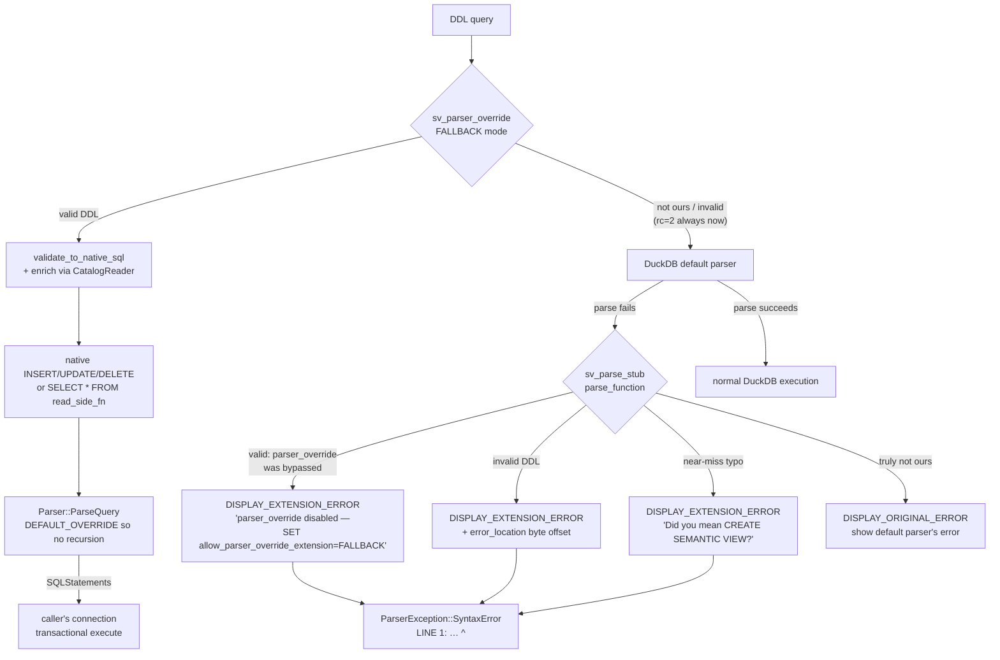

# Phase 62 — Ultra-plan (architectural design)

**Provenance:** This document is the architectural design for Phase 62, originally produced as a remote ultra-plan response on 2026-05-05 and pasted into a planning conversation. Captured here verbatim so it survives context clears and can be read by `/gsd-plan-phase 62`'s research subagent. Companion to `_notes/v0.8.0_phase_62_sqllogictest_spike.md` (test blast-radius scoping).

**Post-consolidation context note (2026-05-05):** The original ultra-plan was written when v0.8.1 was still a separate milestone. After the 2026-05-05 consolidation, all v0.8.1 work folded into v0.8.0, so:
- References to `v081_*.test` filenames map to **`test/sql/v080_transactional_ddl.test`** on disk (no rename happened — the file was already named with the v080 prefix).
- "Add a 0.8.2 (or `[Unreleased]`) section to CHANGELOG" is replaced by "extend the existing `[0.8.0] - Unreleased` section" since `[0.8.1]` was merged in.
- "TECH-DEBT items 20 and 22 marked ✅ resolved" is unchanged in intent.
- Branch is now `milestone/v0.8.0` (not `milestone/v0.8.1`).

Open research questions flagged during assumption review (the planning research subagent should resolve these before the PLAN.md commits to a design):

1. Does `validate_and_rewrite` track positions in the **user's input string** or in the **rewritten SQL**? Caret rendering depends on `error_location` being a byte offset into the user's input. If positions are currently rewritten-SQL-side, the plan needs to add input-side position tracking.
2. Destruction order: when `DBConfig` (and therefore `ParserExtensionInfo`) is destroyed, is the underlying `Database` (and its `duckdb_connection` handles) still valid? `~SemanticViewsParserInfo()` calls `sv_drop_override_context` → `duckdb_disconnect(catalog_conn)`. If the connection is already a dangling handle at that point, the destructor closes nothing or crashes.
3. Other ways the override setting can be disabled besides `disable_peg_parser` + missing FALLBACK re-set? If yes, the rc=3 actionable error message ("`SET allow_parser_override_extension='FALLBACK'`") would be misleading in those other cases.
4. Is read-side table-function registration (`describe_semantic_view`, `list_semantic_views`, `show_semantic_*`, `get_ddl`, `read_yaml_from_semantic_view`) genuinely unaffected by the `OverrideContext` change? The plan asserts yes — confirm by tracing each registration site.

---

# Restore caret-rendered errors without regressing v0.8.x transactional DDL

## Context

v0.8.0 introduced transactional DDL by routing every recognized form through a `parser_override` callback that emits native `INSERT/UPDATE/DELETE` against `semantic_layer._definitions` and re-parses on the caller's connection. v0.8.1 unified all DDL through that one path and retired the legacy `parse_function` / `sv_ddl_internal` table-function fallback.

Retiring `parse_function` had an unintended side effect: DuckDB's `ParseInternal` silently drops `DISPLAY_EXTENSION_ERROR` from `parser_override` when `allow_parser_override_extension='FALLBACK'`. To keep validation messages reaching the user, v0.8.1 synthesises `SELECT error('<msg>')::VARCHAR` and returns it as `PARSE_SUCCESSFUL` (`sql_throwing` in `src/parse.rs:2609`). The text survives but `ParserException::SyntaxError`'s `LINE 1: … ^` caret rendering is gone — errors now arrive as runtime `Invalid Input Error` exceptions (TECH-DEBT item 22, CHANGELOG v0.8.1 known-limitations entry, `test/integration/test_caret_position.py:14-21`).

The fix is to put `parse_function` back, but **only as the error-reporting layer**. `parser_override` keeps the transactional execution path it earned in v0.8.0/v0.8.1; `parse_function` re-runs validation when `parser_override` defers and DuckDB's default parser fails, returning `DISPLAY_EXTENSION_ERROR` with a byte position so `ParserException::SyntaxError` formats the caret. While we are reshaping the C++ shim and `SemanticViewsParserInfo` anyway, we collapse the per-`db_token` LRU (TECH-DEBT item 20) by attaching the `CatalogReader` directly to `parser_info`, whose lifetime is tied to `DBConfig` and so to the database — eliminating both the silent eviction error and the leaked `duckdb_connection` it was working around.

Out of scope (acknowledged but not addressed here): TECH-DEBT items 19 (DESCRIBE/SHOW read committed state), 21 (`disable_peg_parser` resets the override setting), 23 (cross-connection `IF NOT EXISTS` race), and the v0.8.0 limitation on uncommitted user-table reads in `semantic_view()`. Each of these requires DuckDB-side hooks we don't have access to (BindInfo connection, override-setting protection, retry-on-conflict, transaction-aware secondary connection). Item 19 is reachable in principle by rewriting read-side DDL into scalar UDFs over `_definitions`, but it's a large independent refactor and worth a separate milestone. The recommendation is to ship caret + LRU first.

## Architecture



`parser_override` keeps the success path (transactional rewrite + re-parse on caller's connection — every v0.8.0/v0.8.1 win is preserved). For every error case it now defers (`DISPLAY_ORIGINAL_ERROR`) instead of synthesising `SELECT error('…')`. The default parser then fails on the unrecognised DDL prefix; DuckDB calls `parse_function`, which redoes validation and returns `DISPLAY_EXTENSION_ERROR` with `error_location`. `ParserException::SyntaxError` renders the caret.

## Files to modify

### `cpp/src/shim.cpp` — re-introduce `parse_function` + `plan_function`, attach `CatalogReader` to `parser_info`

1. Restore `SemanticViewParseData : ParserExtensionParseData` (single `string query` field; `Copy` returns a clone; `ToString` returns the query). This is the type `parse_function` produces on `PARSE_SUCCESSFUL` — but we will never return that variant, so it's structurally needed only for layout.

2. Reshape `SemanticViewsParserInfo`:
   - Drop `db_token`.
   - Add `void* rust_state` (opaque Rust-side `Box<OverrideContext>`).
   - Override `~SemanticViewsParserInfo()` to call `sv_drop_override_context(rust_state)`.
   - This is the only ParserExtensionInfo we register; its destructor fires when `DBConfig` is destroyed (DB unload), so the catalog connection is finally freed instead of leaked.

3. Add `static ParserExtensionParseResult sv_parse_stub(ParserExtensionInfo *info, const string &query)`:
   - Cast `info` to `SemanticViewsParserInfo*`; pull `rust_state`.
   - Call new FFI `sv_parse_function_rust(rust_state, query_ptr, query_len, error_buf, error_buf_len, &position)` returning `0=success/unreachable`, `1=ours-but-invalid`, `2=not-ours`, `3=valid-but-override-disabled`.
   - On `1` or `3`: build `ParserExtensionParseResult(error_msg)` with `error_location = position` when `position != UINT32_MAX`.
   - On `2`: return default-constructed `ParserExtensionParseResult()` (= `DISPLAY_ORIGINAL_ERROR`).
   - On `0`: defensive fallback — should be unreachable (parser_override would have handled it). Return `DISPLAY_EXTENSION_ERROR` with an internal-error message rather than handing valid DDL to a never-tested plan path.

4. Add `static ParserExtensionPlanResult sv_plan_unreachable(...)` that throws `InternalException` if it ever runs. Registered only because `parse_function` requires its sibling.

5. Update `sv_parser_override` so every error branch returns `ParserOverrideResult()` (= `DISPLAY_ORIGINAL_ERROR`). The `rc=1` branch is gone; the `error_buf` argument to `sv_parser_override_rust` is unused and can be dropped from the FFI signature on the next pass.

6. In `sv_register_parser_hooks`:
   - Replace the `db_token` allocation with a call to a new FFI `sv_make_override_context(catalog_conn, is_file_backed) -> *mut c_void`.
   - Wire the returned pointer into `SemanticViewsParserInfo`.
   - Set `ext.parse_function = sv_parse_stub`, `ext.plan_function = sv_plan_unreachable`, `ext.parser_override = sv_parser_override` (all three).
   - Keep `config.SetOption("allow_parser_override_extension", Value("FALLBACK"))`.

### `src/parse.rs` — drop the LRU, add `parse_function` Rust entry, simplify override entry

1. Delete the `parser_override_catalog` module (the LRU) and `set_catalog_for_parser_override` re-export. Replace with:
   ```rust
   pub struct OverrideContext {
       pub catalog: CatalogReader,
       pub is_file_backed: bool,
   }
   ```
   `OverrideContext` is owned by the C++ shim via `Box<OverrideContext>`; the FFI hands the raw pointer back on every call.

2. Add `#[no_mangle] pub unsafe extern "C" fn sv_make_override_context(conn: ffi::duckdb_connection, is_file_backed: bool) -> *mut c_void` — boxes an `OverrideContext` and leaks it. Symmetric `sv_drop_override_context(ptr: *mut c_void)` re-boxes and drops; the `Drop` impl (new) closes the catalog connection via `duckdb_disconnect` to plug the leak the LRU was working around.

3. Rewrite `sv_parser_override_rust` to take `ctx_ptr: *const c_void` instead of `db_token: u64`. Cast back to `&OverrideContext`. On `Ok(Some(sql))` publish the buffer and return 0. On `Ok(None)` (truly not ours) and on `Err(_)` (validation/enrichment failure) return 2 — the synthesised `SELECT error('…')` path goes away. Same panic guard.

4. Add `#[no_mangle] pub unsafe extern "C" fn sv_parse_function_rust(ctx_ptr, query_ptr, query_len, error_out, error_out_len, position_out) -> u8`:
   - Catch unwind; on panic return 2.
   - UTF-8 check; on failure return 2.
   - If `detect_ddl_kind(query).is_none()`:
     - Run `detect_near_miss(query)`. On hit: write message + position, return 1. Otherwise return 2.
   - Otherwise call `validate_to_native_sql(ctx, query)` (renamed from `rewrite_to_native_sql`):
     - `Ok(Some(_))` → unreachable in normal operation (parser_override should have produced it). Return 3 (valid-but-override-disabled). The C++ side surfaces the actionable hint.
     - `Ok(None)` → unreachable for a matched DDL prefix; return 1 with internal-error.
     - `Err(ParseError { message, position })` → write message; write `position.unwrap_or(u32::MAX)`; return 1.

5. Keep `write_error_to_buffer` (`src/parse.rs:1631`); it now has a real caller again. Delete `sql_throwing` (`src/parse.rs:2609`).

6. The `error_out` parameter on `sv_parser_override_rust` becomes dead — drop it from the FFI signature and the C++ caller (`cpp/src/shim.cpp:127`).

7. The two `rewrite_drop_or_alter` / `rewrite_create` / `rewrite_yaml_file_create` "catalog context evicted" branches go away — `OverrideContext` is always present (its lifetime is tied to the live `parser_info`). Take `&OverrideContext` directly instead of looking up by token.

### `src/lib.rs` — pass the catalog connection through the shim

1. The `init_extension` block at `src/lib.rs:355-386` no longer calls `crate::parse::set_catalog_for_parser_override`. Instead, after `duckdb_connect` returns `catalog_conn`, hand it to `sv_register_parser_hooks(db_handle, catalog_conn, is_file_backed, &mut db_token)` (or add the same context via a separate FFI call). The C++ shim calls `sv_make_override_context` internally.

2. Read-side table function registration is unchanged — they still take `&catalog_reader` (a `Copy` of the same `duckdb_connection`). The `OverrideContext`'s `Drop` is responsible for the connection's lifetime; the table-function copies don't try to free it.

### `test/sql/v080_transactional_ddl.test` (originally `v081_*.test`) and `test/integration/test_caret_position.py`

1. Update `test_caret_position.py:14-21` (and the parallel comments) — the v0.8.1 prose about runtime `Invalid Input Error` is no longer true.

2. Tighten the three caret-position assertions to also match `extract_caret_position(error_text)` (which already exists at `:73-94`) — the column should be at the prefix of the offending token. The function is currently unused in assertions because the v0.8.1 errors had no caret.

3. Add a sqllogictest case that exercises the PEG-disabled actionable error: `CALL disable_peg_parser(); CREATE SEMANTIC VIEW … ;` should now hit the new `rc=3` branch and surface `parser_override disabled — SET allow_parser_override_extension='FALLBACK'` instead of the generic syntax error. Place it next to `peg_compat.test:120-145` and remove the `SET allow_parser_override_extension='FALLBACK';` workaround from the test that follows (or keep it as a happy-path case).

### `CHANGELOG.md` and `TECH-DEBT.md`

1. Extend the existing `[0.8.0] - Unreleased` section with a "Phase 62" entry describing the caret restoration and LRU removal (the original ultra-plan said "0.8.2 or `[Unreleased]`" — superseded by the consolidation; we're folding Phase 62 into v0.8.0 before tagging).
2. In `TECH-DEBT.md`, mark items 20 and 22 as ✅ resolved with a back-reference to Phase 62. Items 19, 21, 23 remain ❓.

## Existing functions/utilities reused

- `validate_and_rewrite` (`src/parse.rs:996`) — unchanged; both hooks call it.
- `detect_near_miss` (`src/parse.rs:946`) — moved from being called inside `sv_parser_override_rust` to being called from `sv_parse_function_rust`.
- `write_error_to_buffer` (`src/parse.rs:1631`) — currently `#[allow(dead_code)]`; becomes the live error-emit path for `sv_parse_function_rust`.
- `ParseError` (`src/errors.rs:12`) — already carries `position: Option<usize>`. The byte offset is what DuckDB needs for `error_location` / caret rendering.
- `ParserExtensionParseResult` constructor with `error_location` (`cpp/include/parser_extension_compat.hpp:84`) — already declared, just unused since v0.8.1.
- `SemanticViewParseData` shape — restored verbatim from the pre-1e7e92b shim (the v0.8.0 commit), so the diff will show as a re-add of code that was deleted.
- `enrich_definition_for_create` / `resolve_pk_from_catalog` (`src/ddl/define.rs`) — unchanged; still take `CatalogReader`.

## Verification

1. **Unit tests** — `cargo test`. Existing 743+ tests should still pass; the LRU test in `src/parse.rs:2761-2786` is removed (the LRU is gone). Add a new test in `src/parse.rs::tests` exercising `sv_parse_function_rust` for: (a) malformed CREATE → rc=1 + position set, (b) near-miss `CRETAE SEMANTIC VIEW` → rc=1 + suggestion text, (c) plain `SELECT 1` → rc=2.

2. **SQL logic tests** — `just build && just test-sql`. Three checks specifically:
   - `peg_compat.test` (with the new actionable-error case).
   - `v080_transactional_ddl.test` — `BEGIN; CREATE; ROLLBACK;` and `INSERT OR REPLACE` row-count cases must still pass byte-identically (transactional behavior is unchanged).
   - Any test using `statement error` for our DDL — error text matching may be sensitive to the new `Parser Error:` prefix vs. the old `Invalid Input Error:` prefix. **Spike report concludes this is a non-issue: zero prefix-bound matchers across the suite.** Update `error: …` patterns where they appear (none expected).

3. **Caret integration test** — `python3 test/integration/test_caret_position.py`. The three existing tests check error text only; tighten them to also assert `extract_caret_position(...)` is non-`None` and points to the start of the bad token (TBL ES, missing `(`, `CRETAE`).

4. **ADBC end-to-end** — `just test-adbc`. Confirms `BEGIN; …; ROLLBACK` semantics survived (the original v0.8.0 win must not regress).

5. **Concurrent-DDL test** — `just test-concurrent`. The `CREATE IF NOT EXISTS` race shape (PK constraint violation on the loser) must not change — limitation 23 is not in scope.

6. **Multi-database memory check** — exercise the long-lived process path that motivated the LRU: in a Python process, sequentially `duckdb.connect(":memory:")` more than 16 times, run a CREATE on each, close them. Memory should stay bounded (the previous test at `src/parse.rs:2763-2786` demonstrated the LRU bounded the map; the new design relies on `DBConfig` destruction calling our `~SemanticViewsParserInfo` which closes the catalog connection). Add a regression test under `test/integration/test_multi_db.py` (or extend an existing one) that asserts no panics and bounded RSS over 50 iterations.

7. **Lint + CI** — `just ci`.
